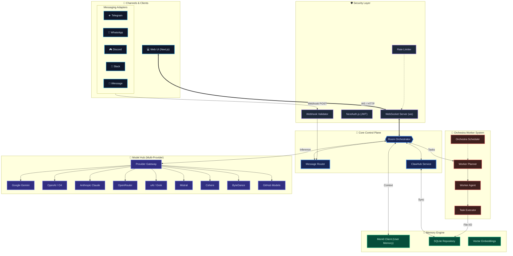

# OpenClaw Architecture Blueprint

This diagram represents the actual implemented architecture of the **OpenClaw Gateway Control Plane**, reflecting the codebase structure including the **Orchestra** worker system, **ClawHub** services, and the **Multi-Provider** model hub.

## System Modules

1.  **Channels**: Fully implemented adapters for Telegram, WhatsApp, Discord, Slack, and iMessage.
2.  **Core**: The `RoomOrchestrator` manages the event loop, while `ClawHub` manages distributed state.
3.  **Orchestra**: A dedicated worker system with its own Scheduler, Planner, and Executors for running background tasks.
4.  **Model Hub**: A unified gateway supporting 10+ providers including Gemini 2.5, GPT-4, Claude 3.7, and Grok.
5.  **Memory**: Hybrid memory system using `Mem0` and local SQLite vector storage.
