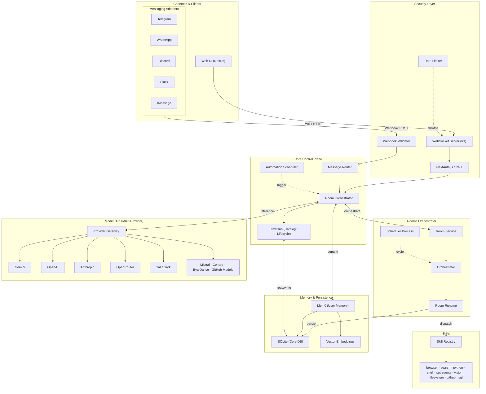

# OpenClaw – Architecture Overview

> Status: 2026-02-21 · Reflects implemented codebase state.

---

## System Diagram



---

## Architecture Layers

| Layer                  | Components                                                         | Source Path                                                          |
| ---------------------- | ------------------------------------------------------------------ | -------------------------------------------------------------------- |
| **Channels**           | Web UI, Telegram, WhatsApp, Discord, Slack, iMessage               | `src/server/channels/`                                               |
| **Security**           | WebSocket Server, NextAuth.js JWT, Webhook Validator, Rate Limiter | `src/server/auth/`, `src/server/security/`                           |
| **Core**               | Message Router, Room Orchestrator, ClawHub, Automation Scheduler   | `src/server/rooms/`, `src/server/clawhub/`, `src/server/automation/` |
| **Rooms Orchestrator** | RoomService, Orchestrator, Runtime, separate Scheduler process     | `src/server/rooms/orchestrator.ts`, `scheduler.ts`                   |
| **Skills**             | 9 built-in skills (7 default-on, 2 opt-in: github, sql)            | `src/server/skills/`, `skills/`                                      |
| **Model Hub**          | Unified provider gateway — 10+ LLM providers                       | `src/server/model-hub/`                                              |
| **Memory**             | Mem0 user memory, SQLite core database, Vector embeddings          | `src/server/memory/`                                                 |

---

## Key Design Decisions

| Decision                      | Detail                                                                               |
| ----------------------------- | ------------------------------------------------------------------------------------ |
| **Single port**               | REST API and WebSocket gateway share one port via custom `server.ts`                 |
| **Rooms-based orchestration** | Multi-persona, lease-based runtime — replaced the former Worker Orchestra API        |
| **Gateway protocol**          | JSON-RPC over WebSocket; four frame types: `req`, `res`, `event`, `stream`           |
| **Persistence**               | SQLite via `better-sqlite3`; no external database required for core operation        |
| **ClawHub**                   | Internal catalog for skill and model registration, installation, and lifecycle       |
| **Automation**                | Cron-style scheduler with lease management; isolated from the room runtime           |
| **Skills**                    | Plugin architecture; skills live under `skills/` and register via `builtInSkills.ts` |

---

## Server Domain Services

```
src/server/
├── agents/          Agent resolution and persona binding
├── auth/            Authentication, JWT, user context
├── automation/      Automation scheduler and lease management
├── channels/        Messaging adapter integrations
├── clawhub/         Skill/model catalog, install, lifecycle
├── config/          Runtime configuration service
├── gateway/         WebSocket gateway, method registry, protocol
├── knowledge/       Knowledge base ingestion and retrieval
├── memory/          Mem0 integration, vector embeddings
├── model-hub/       Multi-provider LLM gateway
├── personas/        Persona definitions and resolution
├── proactive/       Proactive message scheduling
├── rooms/           Room orchestrator, runtime, scheduler
├── security/        Rate limiting, RBAC
├── skills/          Skill registry and built-in skill loader
├── stats/           Usage statistics
└── telemetry/       Logging and observability
```

---

## Related Documentation

- [CORE_HANDBOOK.md](CORE_HANDBOOK.md) — Authoritative technical reference
- [WORKER_ORCHESTRA_SYSTEM.md](WORKER_ORCHESTRA_SYSTEM.md) — Migration from Worker Orchestra to Rooms
- [PERSONA_ROOMS_SYSTEM.md](PERSONA_ROOMS_SYSTEM.md) — Rooms runtime and persona orchestration
- [MODEL_HUB_SYSTEM.md](MODEL_HUB_SYSTEM.md) — Multi-provider model hub
- [SKILLS_SYSTEM.md](SKILLS_SYSTEM.md) — Skills plugin architecture
- [MEMORY_SYSTEM.md](MEMORY_SYSTEM.md) — Memory engine and Mem0 integration
- [CLAWHUB_SYSTEM.md](CLAWHUB_SYSTEM.md) — ClawHub catalog and lifecycle
- [AUTOMATION_SYSTEM.md](AUTOMATION_SYSTEM.md) — Automation scheduler
