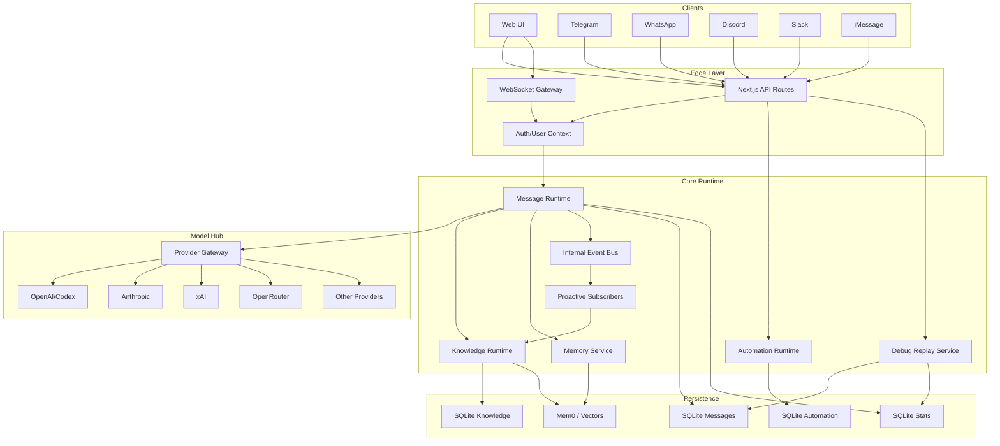

# OpenClaw - Architecture Overview

> Status: 2026-02-22 - Reflects implemented codebase state.

---

## System Diagram



---

## Architecture Layers

| Layer         | Components                                                   | Source Path                                                                                                                   |
| ------------- | ------------------------------------------------------------ | ----------------------------------------------------------------------------------------------------------------------------- |
| Channels      | Web UI, Telegram, WhatsApp, Discord, Slack, iMessage         | `src/server/channels/`                                                                                                        |
| Auth/Security | Auth context, policy checks, request guards                  | `src/server/auth/`, `src/server/security/`                                                                                    |
| Core Runtime  | Message runtime, knowledge, memory, automation, debug replay | `src/server/channels/messages/`, `src/server/knowledge/`, `src/server/memory/`, `src/server/automation/`, `src/server/debug/` |
| Eventing      | Typed in-process event bus and proactive subscribers         | `src/server/events/`, `src/server/proactive/`                                                                                 |
| Model Hub     | Multi-provider gateway and provider adapters                 | `src/server/model-hub/`                                                                                                       |
| Persistence   | SQLite repos, Mem0/vector storage                            | `src/server/**/repository*`, `src/server/memory/`                                                                             |

---

## Key Design Decisions

| Decision                  | Detail                                                                             |
| ------------------------- | ---------------------------------------------------------------------------------- |
| Single process API+WS     | REST API and WebSocket gateway share one app runtime                               |
| Internal event bus        | `chat.message.persisted` and `chat.summary.refreshed` decouple producers/consumers |
| Automation flow authoring | Visual flow graph is validated/compiled into existing automation rule model        |
| Debug replay endpoints    | Dedicated debug routes reconstruct turns and replay from sequence checkpoints      |
| Rooms removed             | Legacy rooms/orchestrator domain is no longer part of active runtime               |

---

## Server Domain Services

```text
src/server/
|- auth/            Authentication and user context
|- automation/      Scheduler, rule/runs, flow compiler/validator
|- channels/        Messaging adapters and message runtime
|- config/          Runtime configuration service
|- debug/           Conversation replay service
|- events/          Typed internal event bus
|- gateway/         WebSocket gateway and method registry
|- knowledge/       Ingestion/retrieval runtime
|- memory/          Mem0 integration and recall
|- model-hub/       Multi-provider model gateway
|- personas/        Persona repository and management
|- proactive/       Event-driven proactive subscribers
|- security/        Policy and access checks
|- skills/          Skill registry/runtime
|- stats/           Prompt dispatch and telemetry repositories
|- telemetry/       Logging and diagnostics
```

---

## Related Documentation

- `docs/API_REFERENCE.md` - HTTP route catalog
- `docs/AUTOMATION_SYSTEM.md` - Automation scheduler and flow API
- `docs/OMNICHANNEL_GATEWAY_SYSTEM.md` - Channel and gateway behavior
- `docs/MEMORY_SYSTEM.md` - Memory architecture
- `docs/DEPLOYMENT_OPERATIONS.md` - Production operations
