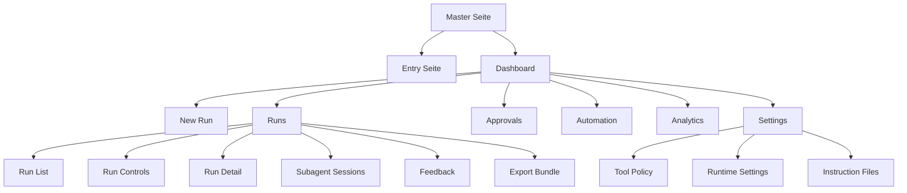
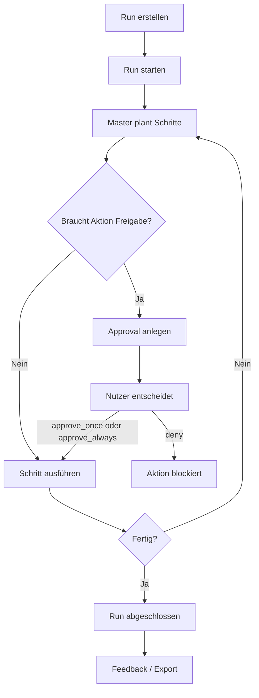

# Master Seite Einfach Erklärt

## Zweck

Diese Seite erklärt die **Master-Seite** in einfacher Sprache.

Die Master-Seite ist das Kontrollzentrum für größere Aufgaben. Statt nur eine einzelne Chat-Antwort zu geben, kann Master:

- eine Aufgabe als **Run** anlegen
- diese Aufgabe Schritt für Schritt ausführen
- bei riskanten Aktionen um **Freigabe** bitten
- Teilaufgaben an **Subagenten** abgeben
- **Erinnerungen** und Automationen verwalten
- Ergebnisse messen und auswerten
- eigene Regeln und Einstellungen speichern

Kurz gesagt:

**Master ist kein normaler Chat. Master ist ein Arbeitsbereich für geplante, nachvollziehbare und kontrollierte Ausführung.**

## Wann man die Master-Seite benutzt

Die Master-Seite ist sinnvoll, wenn eine Aufgabe:

- mehrere Schritte braucht
- Dateien ändern oder erzeugen soll
- externe Systeme verwenden könnte
- Freigaben braucht
- später überprüfbar sein soll
- automatisch oder wiederholt laufen soll

## Einfaches Beispiel

Stell dir vor, du willst:

> "Erstelle eine Projektzusammenfassung, prüfe offene Punkte und exportiere das Ergebnis."

Dann ist die Master-Seite besser als ein normaler Chat, weil Master:

- zuerst einen Run dafür anlegt
- den Status zeigt
- offene Freigaben anzeigt
- Zwischenschritte speichert
- am Ende ein exportierbares Ergebnis liefern kann

## Aufbau der Seite

Die Master-Seite besteht aus mehreren Bereichen.

### 1. Einstieg

Beim Öffnen sieht man zuerst eine **Entry-Seite** mit dem Master-Avatar.

Dort kann man:

- per Stimme sprechen, wenn der Browser das unterstützt
- alternativ Text eingeben
- in das eigentliche Dashboard wechseln

Wenn Sprache nicht unterstützt wird, fällt die Seite automatisch auf Texteingabe zurück.

### 2. Kopfbereich

Im Dashboard zeigt der obere Bereich wichtige Sofort-Infos:

- **Master** Titel
- Kennzeichnung, ob Master als **System-Persona** läuft
- **LIVE** Anzeige, wenn aktive Runs laufen
- **SSE** oder **POLL**, also wie Live-Updates geladen werden
- schnelle Kennzahlen wie Abschlussrate, Prüfquote und Delegationsquote

### 3. Tabs

Die Seite ist in Tabs aufgeteilt:

1. `New Run`
2. `Runs`
3. `Approvals`
4. `Automation`
5. `Analytics`
6. `Settings`

`Settings` erscheint nur im System-Modus.

## Die Tabs im Detail

### New Run

Hier startet man neue Aufgaben.

Felder:

- **Persona**
  - im System-Modus ist Master fest eingestellt
  - im Legacy-Modus kann eine Persona gewählt werden
- **Workspace**
  - bestimmt, in welchem Arbeitsbereich gearbeitet wird
- **Title**
  - kurzer Name für die Aufgabe
- **Contract**
  - genaue Beschreibung, was erledigt werden soll

Beispiel:

- Title: `Release Notes erstellen`
- Contract: `Analysiere die letzten Änderungen, fasse die wichtigsten Punkte zusammen, markiere Risiken und exportiere das Ergebnis als lesbares Bundle.`

Wichtig:

- Ohne Contract kann kein Run erstellt werden.
- Nach dem Erstellen springt man typischerweise zu `Runs`.

### Runs

Hier sieht man alle bisherigen und laufenden Aufgaben.

Funktionen:

- Liste aller Runs
- Suche nach Titel
- Filter nach Status
  - alle
  - aktiv
  - fertig
  - fehlgeschlagen
- Auswahl eines Runs
- Steuerung des ausgewählten Runs

Zu jedem Run sieht man typischerweise:

- Titel
- Status
- Zeitpunkt
- ob Freigaben fehlen
- Detail-Schritte

#### Run Controls

Für einen ausgewählten Run gibt es Aktionen wie:

- **Start**
- **Cancel**
- **Export**

Wenn ein Run auf Freigabe wartet, kann die Entscheidung direkt aus dem Kontext des Runs ausgelöst werden.

#### Run Detail

Hier sieht man die einzelnen Schritte des Runs.

Das hilft bei Fragen wie:

- Was wurde schon gemacht?
- Wo hängt der Run?
- Welcher Schritt ist fehlgeschlagen?

#### Feedback

Wenn ein Run abgeschlossen ist, kann man Feedback geben.

Das ist nützlich, um später die Qualität zu verbessern.

#### Export Bundle

Wenn ein Run exportiert wird, erscheint ein Ergebnis-Bundle.

Das ist praktisch, wenn man:

- Ergebnisse weitergeben will
- einen Nachweis braucht
- einen dokumentierten Abschluss speichern möchte

### Approvals

Hier sieht man alle offenen und kürzlich bearbeiteten Freigaben.

Eine Freigabe ist nötig, wenn Master etwas tun will, das kontrolliert werden soll, zum Beispiel:

- Shell-Befehle ausführen
- Dateien schreiben
- HTTP-POST Aktionen starten
- E-Mails senden

Mögliche Entscheidungen:

- **approve_once**
  - nur dieses eine Mal erlauben
- **approve_always**
  - für denselben Fingerabdruck künftig automatisch erlauben
- **deny**
  - Aktion verbieten

Beispiel:

Master möchte einen Befehl ausführen:

> `shell.exec` im Projektordner

Dann kann der Nutzer entscheiden:

- einmal erlauben
- immer erlauben
- ablehnen

### Automation

Hier sieht man Erinnerungen und automatische Vorgänge.

Die Ansicht zeigt:

- welche Erinnerungen existieren
- ob sie `pending`, `fired`, `paused` oder `cancelled` sind
- welche Automationen noch offen sind

Beispiel:

- Erinnerung: `Morgen um 09:00 offene PR prüfen`
- Status zuerst: `pending`
- nach Ausführung: `fired`

Das hilft, wiederkehrende oder zeitgesteuerte Aufgaben im Blick zu behalten.

### Analytics

Hier sieht man Leistungswerte von Master.

Wichtige Kennzahlen:

- **Completion**
  - wie viele Runs erfolgreich abgeschlossen wurden
- **Verify Pass**
  - wie oft Prüfungen erfolgreich waren
- **Delegation**
  - wie erfolgreich Subagenten-Aufgaben waren

Zusätzlich gibt es den Bereich **Learning Loop**.

Das ist eine geplante, tägliche Lern- und Verbesserungslogik. Sie zeigt zum Beispiel:

- Learning Cycle Success
- Tool Forge Success

Einfach gesagt:

Master schaut hier nicht nur auf einzelne Aufgaben, sondern auf die Qualität seiner Arbeitsweise insgesamt.

### Settings

Dieser Bereich ist die Schaltzentrale für Master selbst.

Hier kann man einstellen:

- bevorzugtes Modell
- Model-Hub-Profil
- ob Master autonom arbeiten darf
- maximale Anzahl von Tool-Aufrufen
- erlaubte Tool-Funktionen
- Tool-Policy
- Inhalte von `SOUL.md`, `AGENTS.md` und `USER.md`

#### Tool Policy

Die Tool Policy bestimmt, wie vorsichtig Master mit Tools umgehen soll.

Wichtige Modi:

- `deny`
  - nichts erlauben
- `allowlist`
  - nur ausdrücklich erlaubte Dinge zulassen
- `full`
  - grundsätzlich alles innerhalb der erlaubten Grenzen zulassen

Zusätzlich gibt es das Verhalten für Freigaben:

- `off`
  - keine Nachfrage
- `on_miss`
  - nur fragen, wenn etwas nicht auf der Allowlist steht
- `always`
  - immer fragen

Beispiel:

- Security: `allowlist`
- Ask: `on_miss`
- Allowlist: `shell.exec:gateway:D:/web/clawtest:*`

Bedeutung in einfacher Sprache:

- Shell-Befehle in diesem Projektordner sind bekannt
- alles andere braucht eine Freigabe oder wird blockiert, je nach Regel

## Live-Verhalten der Seite

Die Master-Seite versucht, live zu bleiben.

Dafür gibt es zwei Wege:

- **SSE**
  - der Server sendet Änderungen direkt an die Seite
- **Polling**
  - die Seite fragt regelmäßig selbst nach

Die Anzeige im Kopfbereich zeigt:

- `SSE`, wenn Live-Events aktiv verbunden sind
- `POLL`, wenn auf regelmäßige Abfragen zurückgefallen wird

Das ist wichtig, damit man offene Freigaben oder Statuswechsel schnell sieht.

## Beispiele aus dem Alltag

### Beispiel 1: Dokument erstellen

Du möchtest:

> "Erstelle aus den letzten Änderungen eine verständliche Kunden-Zusammenfassung."

Ablauf:

1. In `New Run` Titel und Contract eingeben.
2. Run erstellen.
3. In `Runs` den Run starten.
4. In `Run Detail` beobachten, was passiert.
5. Falls eine Aktion Freigabe braucht, in `Approvals` entscheiden.
6. Am Ende Ergebnis exportieren.

### Beispiel 2: Sichere Shell-Nutzung

Du möchtest, dass Master nur in einem bestimmten Projektordner Shell-Befehle ausführt.

Dann:

1. `Settings` öffnen.
2. Tool Policy auf `allowlist` stellen.
3. Ask auf `on_miss` stellen.
4. den Projektordner auf die Allowlist setzen.

Ergebnis:

- bekannte Befehle im erlaubten Bereich laufen kontrolliert
- unbekannte Bereiche werden nicht einfach so ausgeführt

### Beispiel 3: Warten auf Freigabe

Ein Run möchte eine riskante Aktion ausführen.

Dann passiert Folgendes:

- der Run wechselt auf `AWAITING_APPROVAL`
- in `Approvals` erscheint der Eintrag
- nach deiner Entscheidung geht es weiter oder der Schritt wird gestoppt

### Beispiel 4: Teilaufgaben auslagern

Eine Aufgabe ist groß und wird aufgeteilt.

Dann sieht man unter `Runs` zusätzlich **Subagent Sessions**.

Damit kann man verstehen:

- welche Teilaufgaben ausgelagert wurden
- ob sie laufen, fertig oder fehlgeschlagen sind
- ob eine Session abgebrochen wurde

## Wichtige Begriffe einfach erklärt

### Run

Ein Run ist ein kompletter Arbeitsauftrag von Anfang bis Ende.

### Contract

Der Contract ist die genaue Aufgabenbeschreibung für den Run.

### Approval

Eine Approval ist eine notwendige Freigabe für eine sensible Aktion.

### Subagent

Ein Subagent ist ein ausgelagerter Helfer für eine Teilaufgabe.

### Workspace

Der Workspace ist der Arbeitskontext, also der Bereich, in dem Master arbeitet.

### Export Bundle

Das Export Bundle ist das verpackte Ergebnis eines Runs.

## Wie die Master-Seite intern aufgebaut ist

### Einfaches Struktur-Diagramm



### Datenfluss-Diagramm

```mermaid
flowchart LR
    UI[Master UI] --> Hook[useMasterView]
    Hook --> API[/api/master/*]
    API --> Runtime[Master Runtime]
    Runtime --> Repo[(Master Datenbank)]

    Runtime --> Events[/api/master/events SSE/]
    Events --> Hook
```

### Ablauf eines Runs



## Was an der Seite besonders wichtig ist

- Master arbeitet **nicht blind**
- sensible Aktionen können **angehalten und freigegeben** werden
- große Aufgaben bleiben **sichtbar und nachvollziehbar**
- Teilaufgaben sind **delegierbar**
- Automationen und Erinnerungen sind **im selben Kontrollzentrum**
- Einstellungen und Tool-Regeln sind **dauerhaft speicherbar**

## Kurzfassung für Nicht-Techniker

Wenn man es ganz einfach sagen will:

Die Master-Seite ist eine Art **Arbeitsleitstand für KI-Aufgaben**.

Sie hilft dabei,

- Aufgaben sauber anzulegen
- den Fortschritt zu sehen
- riskante Aktionen zu kontrollieren
- Ergebnisse zu exportieren
- Regeln und Automationen dauerhaft zu verwalten

Sie ist also weniger ein Chat-Fenster und mehr ein **Cockpit für planbare KI-Arbeit**.
