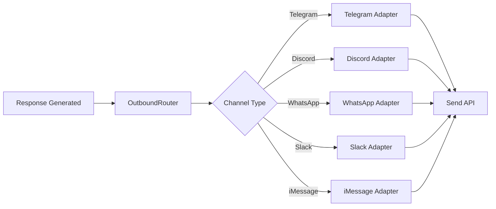
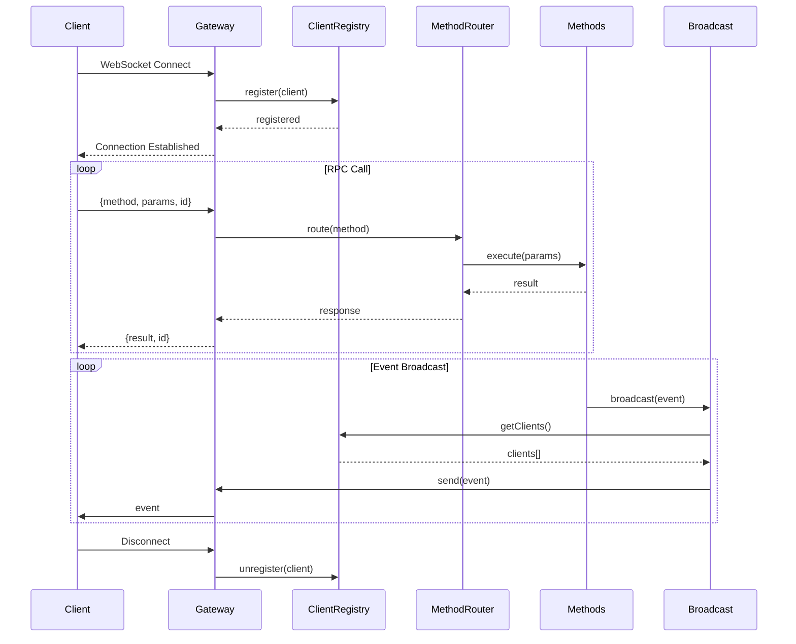
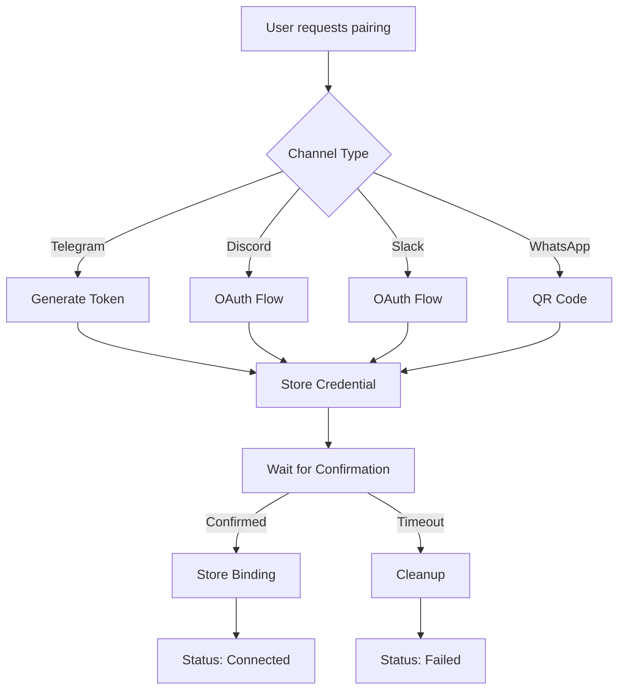
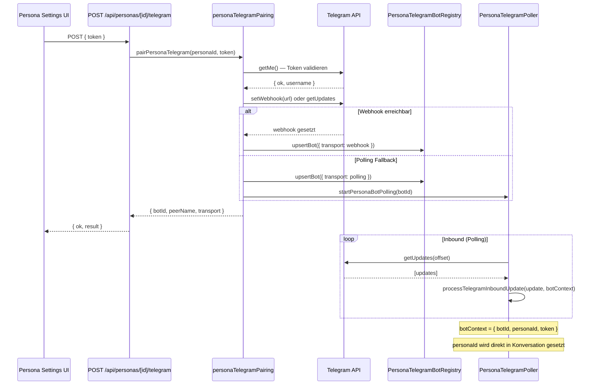
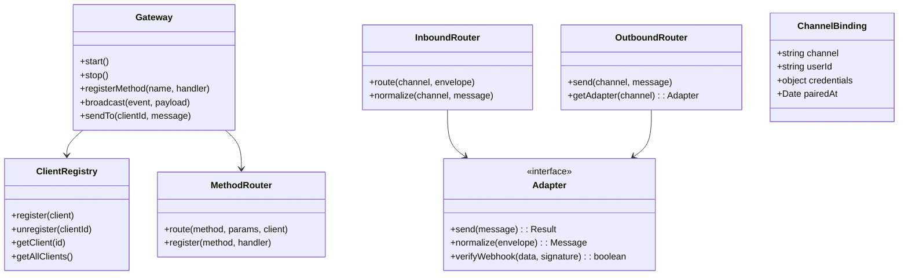

# Omnichannel and Gateway System

## Metadata

- Purpose: Verbindliche Referenz fuer Multi-Channel-Routing und Gateway-Kommunikation.
- Scope: Inbound/Outbound Routing, Adapter, Pairing, Webhooks, Gateway-RPC/Event-Flow.
- Source of Truth: This is the active system documentation for this domain and overrides archived documents on conflicts.
- Last Reviewed: 2026-02-21
- Related Runbooks: docs/runbooks/gateway-config-production-rollout.md

---

## 1. Funktionserläuterung

Das Omnichannel-Gateway-System ermöglicht Multi-Channel-Messaging über verschiedene Plattformen (Telegram, WhatsApp, Discord, iMessage, Slack) mit WebSocket-basiertem Realtime-Layer für Events und RPC.

### Kernkonzepte

- **Channel**: Externe Messaging-Plattform
- **Adapter**: Plattform-spezifische Integration
- **Inbound**: Eingehende Nachrichten
- **Outbound**: Ausgehende Nachrichten
- **Pairing**: Verknüpfung mit externen Plattformen
- **WebSocket Gateway**: Realtime-Kommunikation
- **Persona-bound Bot**: Telegram-Bot, der exklusiv einer Persona zugeordnet ist — jede Persona hat ihren eigenen Bot-Token und damit einen eigenständigen Chat-Thread

---

## 2. Workflow-Diagramme

### 2.1 Inbound Message Flow

```mermaid
sequenceDiagram
    participant Ext as External Platform
    participant WH as Webhook
    participant IR as InboundRouter
    participant NR as Normalizer
    participant MR as MessageRouter
    participant MS as MessageService
    participant MH as ModelHub

    Ext->>WH: Incoming Message
    WH->>WH: Verify Signature
    WH->>IR: Route to Adapter

    IR->>NR: normalize(envelope)
    NR-->>IR: normalized message

    IR->>MR: route(message)
    MR->>MR: determineTarget()

    alt Direct Message
        MR->>MS: handleInbound()
        MS->>MS: deduplicate()
        MS->>MS: buildContext()
        MS->>MH: dispatch()
        MH-->>MS: response
        MS->>MS: saveMessage()
    else Room Message
        MR->>R[Room Service]
        R->>R: process()
    end

    MS-->>IR: result
    IR-->>Ext: Acknowledge
```

### 2.2 Outbound Message Flow



### 2.3 WebSocket Gateway Flow



### 2.4 Channel Pairing Flow



### 2.5 Persona-gebundener Telegram Bot Flow



---

## 3. Technische Architektur

### 3.1 Komponenten-Übersicht

```
src/server/channels/
├── adapters/
│   ├── capabilities.ts       # Adapter-Fähigkeiten
│   └── types.ts              # Adapter-Typen
├── inbound/
│   ├── envelope.ts           # Message Envelope
│   └── normalizers.ts        # Plattform-Normalisierung
├── outbound/
│   ├── telegram.ts           # Telegram Outbound
│   ├── discord.ts            # Discord Outbound
│   ├── whatsapp.ts           # WhatsApp Outbound
│   ├── slack.ts              # Slack Outbound
│   └── imessage.ts           # iMessage Outbound
├── pairing/
│   ├── telegram.ts           # Telegram Pairing
│   ├── discord.ts            # Discord Pairing
│   ├── slack.ts              # Slack Pairing
│   ├── bridge.ts             # Bridge-Integration
│   └── unpair.ts             # Unpair-Logik
├── routing/
│   ├── adapterRegistry.ts    # Adapter-Registry
│   ├── inboundRouter.ts      # Inbound-Routing
│   └── outboundRouter.ts     # Outbound-Routing
├── credentials/              # Credential-Management
├── messages/                 # Message-Verarbeitung
└── webhookAuth.ts            # Webhook-Sicherheit

src/server/gateway/
├── index.ts                  # Gateway Exporte
├── connection-handler.ts     # WS-Verbindungen
├── client-registry.ts        # Client-Management
├── method-router.ts          # RPC-Routing
├── broadcast.ts              # Broadcast-System
├── events.ts                 # Event-Definitionen
├── protocol.ts               # Gateway-Protokoll
└── methods/                  # RPC-Methoden
    ├── chat.ts
    ├── channels.ts
    ├── sessions.ts
    ├── worker.ts
    ├── logs.ts
    └── presence.ts
```

### 3.2 Klassendiagramm



### 3.3 Systemarchitektur

```mermaid
flowchart TB
    subgraph External
        TG[Telegram]
        DC[Discord]
        WA[WhatsApp]
        SL[Slack]
        IM[iMessage]
    end

    subgraph Webhooks
        WH1[/telegram/webhook]
        WH2[/discord/webhook]
        WH3[/whatsapp/webhook]
        WH4[/slack/webhook]
        WH5[/imessage/webhook]
    end

    subgraph Channels
        IR[InboundRouter]
        OR[OutboundRouter]
        AR[AdapterRegistry]
    end

    subgraph Gateway
        WS[WebSocket Server]
        CR[ClientRegistry]
        MR[MethodRouter]
        BC[Broadcast]
    end

    subgraph Domain
        MS[MessageService]
        RS[RoomService]
        WS2[WorkerService]
    end

    subgraph Clients
        Web[Web App]
        Mobile[Mobile App]
    end

    TG --> WH1
    DC --> WH2
    WA --> WH3
    SL --> WH4
    IM --> WH5

    WH1 --> IR
    WH2 --> IR
    WH3 --> IR
    WH4 --> IR
    WH5 --> IR

    IR --> AR
    OR --> AR

    IR --> MS
    IR --> RS

    MS --> OR
    RS --> OR
    WS2 --> OR

    Web --> WS
    Mobile --> WS

    WS --> CR
    WS --> MR
    MR --> MS
    MR --> RS
    MR --> WS2

    MS --> BC
    RS --> BC
    BC --> CR
```

---

## 4. Unterstützte Kanäle

| Kanal                       | Inbound | Outbound | Pairing              | Webhook Auth |
| --------------------------- | ------- | -------- | -------------------- | ------------ |
| Telegram (global)           | ✅      | ✅       | Token (Credential)   | Signature    |
| Telegram (Persona-Bot) ⬇️   | ✅      | ✅       | Token (Persona-DB)   | Signature    |
| Discord                     | ✅      | ✅       | OAuth                | Signature    |
| WhatsApp                    | ✅      | ✅       | Bridge               | Secret       |
| Slack                       | ✅      | ✅       | OAuth                | Secret       |
| iMessage                    | ✅      | ✅       | Bridge               | Secret       |
| WebChat                     | ✅      | ✅       | Internal             | -            |

> **Persona-gebundene Telegram Bots** ermöglichen es, pro Persona einen eigenen Bot-Token zu registrieren. Jeder Bot erhält eine eigene `botId`, einen separaten Webhook (`/api/channels/telegram/bots/[botId]/webhook`) oder Polling-Loop und liefert eingehende Nachrichten direkt unter der konfigurierten Persona aus — ohne globale `/persona`-Umschaltung.

---

## 5. WebSocket Events

### 5.1 Client -> Server (RPC)

```typescript
interface RPCRequest {
  id: string;
  method: string;
  params: unknown;
}

// Methoden
('chat.send'); // Nachricht senden
('chat.stream'); // Streaming-Nachricht
('chat.abort'); // Generierung abbrechen
('sessions.delete'); // Session löschen
('sessions.reset'); // Session zurücksetzen
('sessions.patch'); // Session aktualisieren
('channels.list'); // Channel-Liste
('channels.pair'); // Channel koppeln
('channels.unpair'); // Channel trennen
('inbox.list'); // Inbox-Liste
('worker.start'); // Worker starten
('automation.run'); // Automation ausführen
```

### 5.2 Server -> Client (Events)

```typescript
// Room Events
'room.message';
'room.member.status';
'room.run.status';
'room.intervention';
'room.metrics';

// Chat Events
'conversation.new';
'conversation.deleted';
'conversation.reset';
'chat.typing';
'chat.aborted';

// Worker Events
'worker.status';
'worker.activity';

// Automation Events
'automation.triggered';

// Presence
'presence.update';
```

---

## 6. Webhook Security

### 6.1 Signature Verification

```typescript
// Telegram
const isValid =
  crypto.createHmac('sha256', TELEGRAM_WEBHOOK_SECRET).update(data).digest('hex') === signature;

// Discord
const isValid = verifyDiscordSignature(body, signature, timestamp, DISCORD_PUBLIC_KEY);
```

### 6.2 Umgebungsvariablen

| Variable                | Beschreibung       |
| ----------------------- | ------------------ |
| TELEGRAM_WEBHOOK_SECRET | Telegram Secret    |
| DISCORD_PUBLIC_KEY      | Discord Public Key |
| WHATSAPP_WEBHOOK_SECRET | WhatsApp Secret    |
| IMESSAGE_WEBHOOK_SECRET | iMessage Secret    |
| SLACK_WEBHOOK_SECRET    | Slack Secret       |

---

## 7. API-Referenz

### 7.1 Channel Management

```
GET    /api/channels/state         # Channel-Status
POST   /api/channels/pair          # Channel koppeln
DELETE /api/channels/pair          # Channel trennen
GET    /api/channels/inbox         # Nachrichten-Inbox
```

### 7.2 Webhooks

```
POST /api/channels/telegram/webhook
POST /api/channels/telegram/bots/[botId]/webhook   # Persona-gebundener Bot-Webhook
POST /api/channels/discord/webhook
POST /api/channels/whatsapp/webhook
POST /api/channels/slack/webhook
POST /api/channels/imessage/webhook
```

### 7.3 Telegram Pairing (globaler Bot)

```
POST /api/channels/telegram/pairing/confirm
POST /api/channels/telegram/pairing/poll
```

### 7.4 Persona-gebundene Telegram Bots

```
GET    /api/personas/[id]/telegram   # Bot-Status für Persona (ohne Token)
POST   /api/personas/[id]/telegram   # Bot verbinden: { token: string }
DELETE /api/personas/[id]/telegram   # Bot trennen
```

Die `POST`-Route validiert den Token via `getMe`, wählt Webhook oder Polling-Transport, speichert den Bot in `persona_telegram_bots` (SQLite) und startet den Poller falls nötig. Der Token wird nie in API-Responses zurückgegeben.

---

## 8. Verifikation

```bash
# Unit Tests
npm run test -- tests/unit/gateway
npm run test -- tests/unit/channels

# Integration Tests
npm run test -- tests/integration/channels
npm run test -- tests/integration/gateway

# Lint
npm run lint

# Typecheck
npm run typecheck
```

---

## 9. Persona-Telegram-Bot Konfiguration

### Datenbankschema

Tabelle `persona_telegram_bots` in `personas.db` (`PERSONAS_DB_PATH || '.local/personas.db'`):

```sql
CREATE TABLE persona_telegram_bots (
  bot_id         TEXT PRIMARY KEY,
  persona_id     TEXT UNIQUE NOT NULL,
  token          TEXT NOT NULL,
  webhook_secret TEXT NOT NULL,
  peer_name      TEXT,
  transport      TEXT NOT NULL DEFAULT 'polling',  -- 'webhook' | 'polling'
  polling_offset INTEGER NOT NULL DEFAULT 0,
  active         INTEGER NOT NULL DEFAULT 1,
  created_at     TEXT NOT NULL,
  updated_at     TEXT NOT NULL
);
```

### BotContext bei Inbound

Wenn Nachrichten über einen Persona-Bot eingehen, wird ein `TelegramBotContext` mitgegeben:

```typescript
interface TelegramBotContext {
  botId: string;
  personaId: string;
  token: string;
}
```

Dadurch überspringt `processTelegramInboundUpdate` die globale Pairing-Prüfung und setzt die Persona direkt auf der Konversation.

### Outbound Token-Auflösung

`deliverTelegram` löst den Bot-Token in dieser Reihenfolge auf:
1. `options.token` — direkte Übergabe
2. `options.personaId` → `PersonaTelegramBotRegistry.getBotByPersonaId(personaId).token`
3. Globaler Credential-Store (`telegram.bot_token`)

Da `responseHelper.ts` `conversation.personaId` automatisch weitergibt, wird für Persona-Bot-Konversationen immer der richtige Bot-Token verwendet.

### Server-Start

`server.ts` startet beim Hochfahren alle aktiven Polling-Bots aus der Registry automatisch:

```typescript
// Alle aktiven Polling-Bots beim Start wiederherstellen
const bots = registry.listActiveBots().filter((b) => b.transport === 'polling');
await Promise.all(bots.map((b) => startPersonaBotPolling(b.botId)));
```

Beim Shutdown werden alle Poller via `stopAllPersonaBotPolling()` sauber gestoppt.

---

## 10. Siehe auch

- docs/SESSION_MANAGEMENT.md
- docs/PERSONA_ROOMS_SYSTEM.md
- docs/SECURITY_SYSTEM.md
