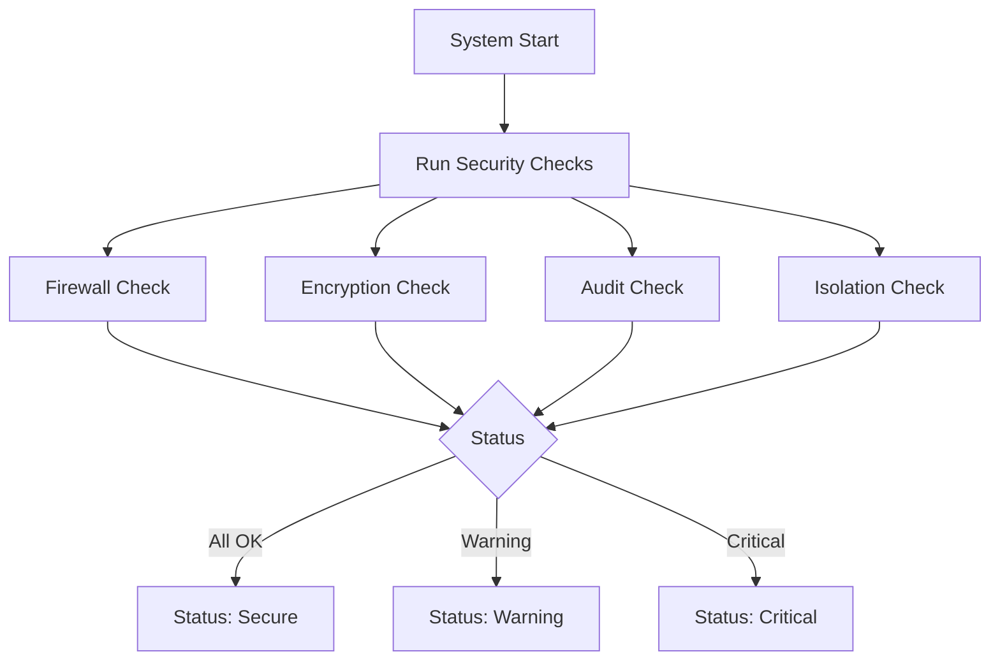
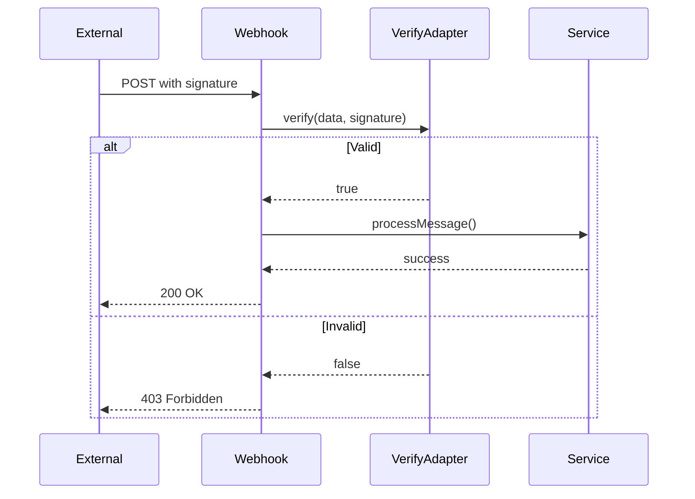
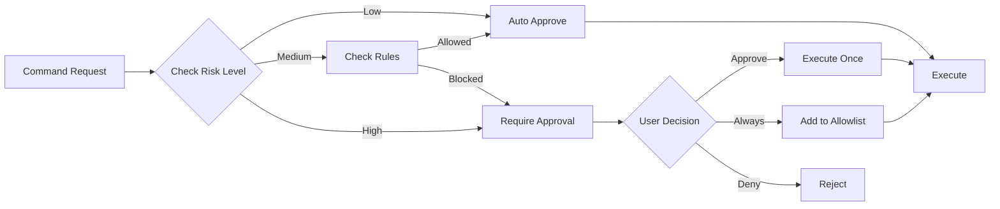

# Security System

**Stand:** 2026-02-17

## 1. Funktionserläuterung

Das Security-System umfasst Security-Checks, Channel-Webhook-Signaturen, Command-Permissions mit Risk-Levels und Credential-Store für sichere Konfiguration.

### Kernkonzepte

- **Security Checks**: Firewall, Encryption, Audit, Isolation
- **Webhook Security**: Signatur-Verifikation
- **Command Permissions**: Risk-Level-basierte Genehmigung
- **Credential Store**: Sichere Speicherung von Secrets

---

## 2. Workflow-Diagramme

### 2.1 Security Check Flow



### 2.2 Webhook Verification Flow



### 2.3 Command Approval Flow



---

## 3. Technische Architektur

### 3.1 Komponenten

```
src/server/security/
└── status.ts               # Security-Status

src/server/channels/
├── credentials/
│   └── credentialStore.ts  # Credential-Management
└── webhookAuth.ts          # Webhook-Auth
```

### 3.2 Security Checks

| Check      | Aspekt             | Status              |
| ---------- | ------------------ | ------------------- |
| Firewall   | High-Risk Commands | ok/warning/critical |
| Encryption | HTTPS/WebCrypto    | ok/warning/critical |
| Audit      | Audit-Logging      | ok/warning          |
| Isolation  | Task-Isolation     | ok/warning/critical |

---

## 4. API-Referenz

```
GET /api/security/status      # Security-Status
```

---

## 5. Umgebungsvariablen

| Variable                | Beschreibung       |
| ----------------------- | ------------------ |
| TELEGRAM_WEBHOOK_SECRET | Telegram Secret    |
| DISCORD_PUBLIC_KEY      | Discord Public Key |
| WHATSAPP_WEBHOOK_SECRET | WhatsApp Secret    |
| IMESSAGE_WEBHOOK_SECRET | iMessage Secret    |
| SLACK_WEBHOOK_SECRET    | Slack Secret       |

---

## 6. Siehe auch

- docs/OMNICHANNEL_GATEWAY_SYSTEM.md
- docs/CORE_HANDBOOK.md
