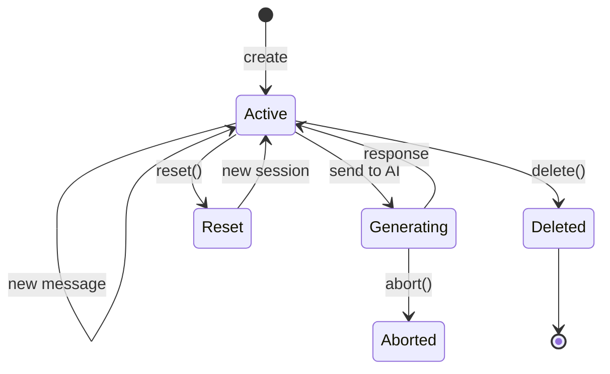
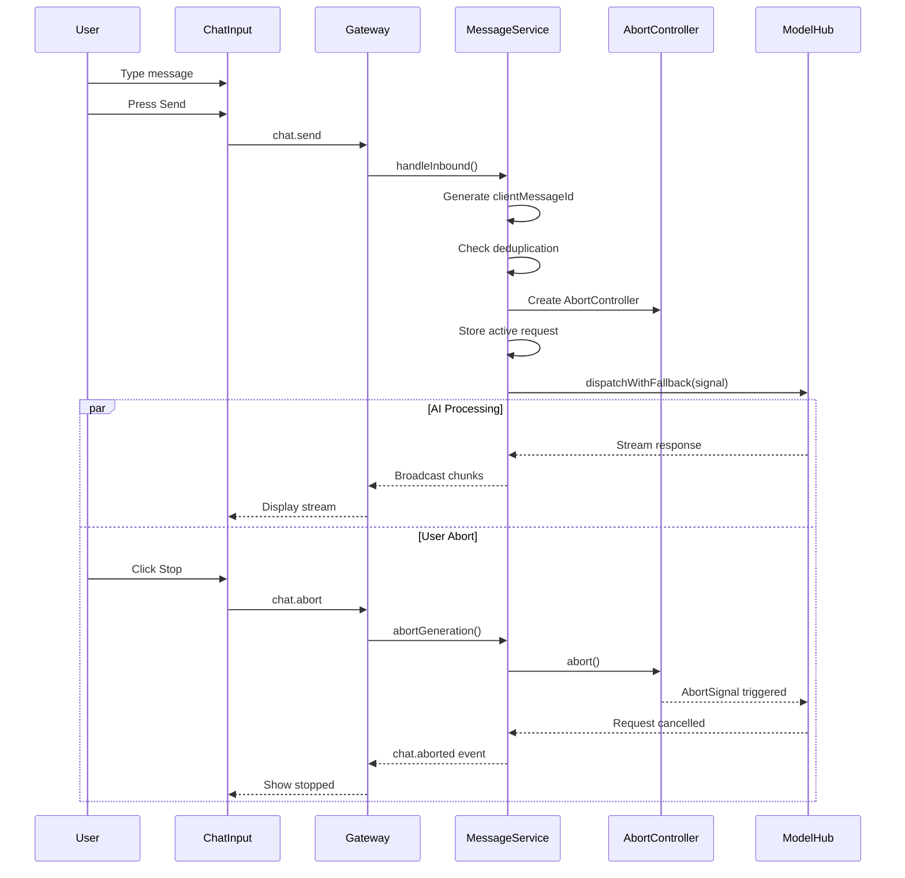
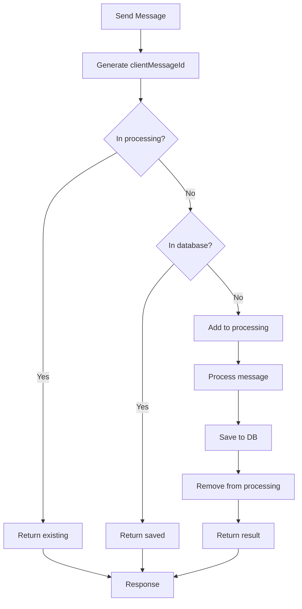
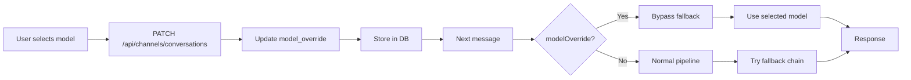
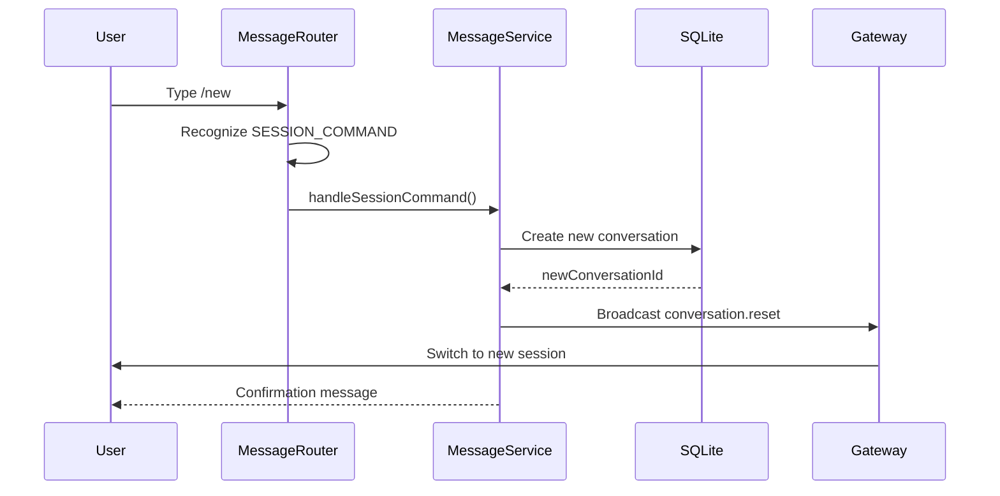
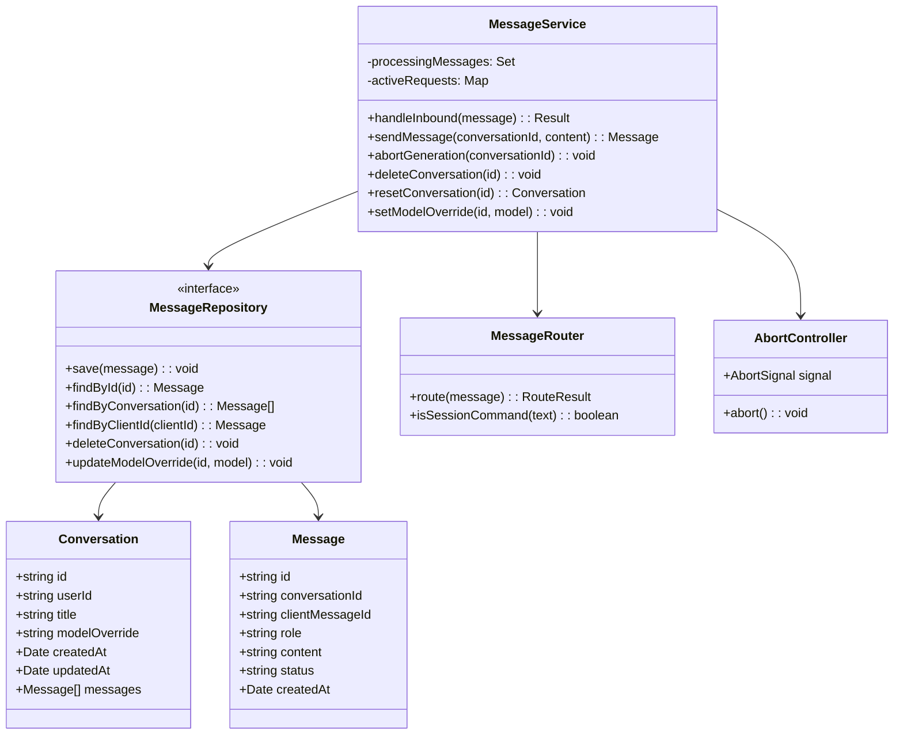
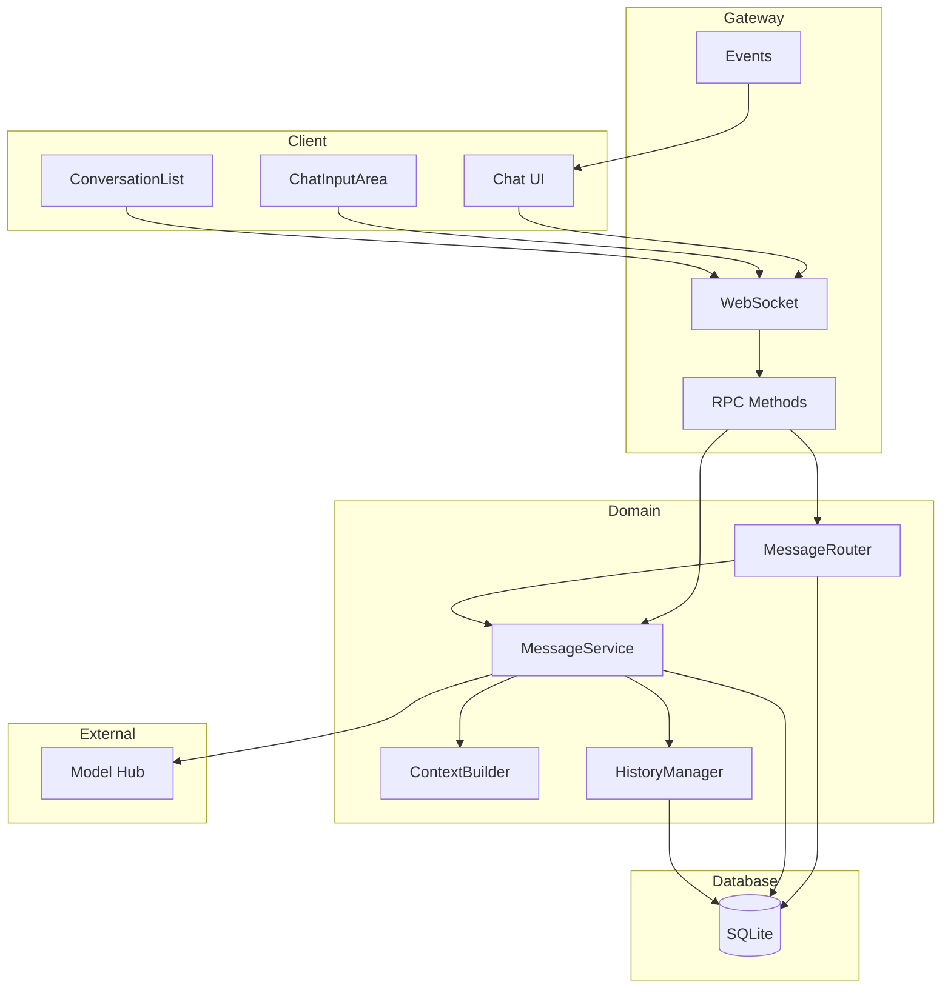
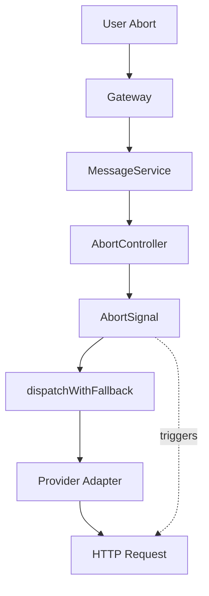

# Session Management System

**Stand:** 2026-02-17

## 1. Funktionserläuterung

Das Session-Management-System verwaltet Konversationen (Sessions) zwischen Benutzern und der KI. Es bietet vollständige Kontrolle über Chat-Verläufe inklusive Abbruch laufender Anfragen, Löschen, Zurücksetzen und Model-Overrides.

### Kernkonzepte

- **Conversation**: Eine Chat-Session mit Nachrichtenverlauf
- **Message**: Einzelne Nachricht (User oder AI)
- **AbortSignal**: Mechanismus zum Abbrechen laufender KI-Anfragen
- **Idempotency**: Verhinderung doppelter Nachrichten
- **Model Override**: Pro-Session Model-Auswahl

---

## 2. Workflow-Diagramme

### 2.1 Session Lifecycle



### 2.2 Chat Flow mit Abort



### 2.3 Idempotency Flow



### 2.4 Model Override Flow



### 2.5 Session Reset Flow



---

## 3. Technische Architektur

### 3.1 Komponenten-Übersicht

```
src/server/channels/messages/
├── service.ts              # MessageService (Kern-Logik)
├── repository.ts           # Repository-Interface
├── sqliteMessageRepository.ts  # SQLite-Implementierung
├── messageRouter.ts        # Routing-Logik
├── messageRowMappers.ts    # DB-Mapping
├── historyManager.ts       # Verlaufs-Management
├── sessionManager.ts       # Session-Management
├── contextBuilder.ts       # Kontext-Aufbau
├── attachments.ts          # Datei-Anhänge
├── autoMemory.ts           # Automatisches Memory
└── statusIcons.ts          # Status-Indikatoren
```

### 3.2 Klassendiagramm



### 3.3 Datenbank-Schema

```sql
-- Conversations
CREATE TABLE conversations (
    id TEXT PRIMARY KEY,
    user_id TEXT NOT NULL,
    title TEXT,
    model_override TEXT,
    created_at DATETIME DEFAULT CURRENT_TIMESTAMP,
    updated_at DATETIME DEFAULT CURRENT_TIMESTAMP
);

-- Messages
CREATE TABLE messages (
    id TEXT PRIMARY KEY,
    conversation_id TEXT NOT NULL,
    client_message_id TEXT UNIQUE,
    role TEXT NOT NULL,
    content TEXT NOT NULL,
    status TEXT DEFAULT 'pending',
    created_at DATETIME DEFAULT CURRENT_TIMESTAMP,
    FOREIGN KEY (conversation_id) REFERENCES conversations(id)
);

-- Unique Index für Idempotency
CREATE UNIQUE INDEX idx_client_message
ON messages(conversation_id, client_message_id);
```

### 3.4 Systemarchitektur



---

## 4. Session Commands

| Command | Beschreibung                |
| ------- | --------------------------- |
| /new    | Neue Konversation erstellen |
| /reset  | Session zurücksetzen        |

---

## 5. WebSocket Events

### 5.1 Client -> Server

```typescript
// Nachricht senden
interface ChatSendRequest {
  conversationId: string;
  content: string;
  clientMessageId?: string;
}

// Generierung abbrechen
interface ChatAbortRequest {
  conversationId: string;
}

// Session löschen
interface SessionDeleteRequest {
  conversationId: string;
}

// Session zurücksetzen
interface SessionResetRequest {
  title?: string;
}

// Model Override
interface SessionPatchRequest {
  conversationId: string;
  modelOverride?: string;
}
```

### 5.2 Server -> Client

```typescript
// Neue Konversation
interface ConversationNewEvent {
  conversation: Conversation;
}

// Konversation gelöscht
interface ConversationDeletedEvent {
  conversationId: string;
}

// Session zurückgesetzt
interface ConversationResetEvent {
  oldConversationId: string;
  newConversationId: string;
}

// Generierung abgebrochen
interface ChatAbortedEvent {
  conversationId: string;
  messageId: string;
}
```

---

## 6. AbortSignal Chain



---

## 7. API-Referenz

### 7.1 REST Endpunkte

```
GET    /api/channels/conversations       # Alle Konversationen
POST   /api/channels/conversations       # Konversation erstellen
DELETE /api/channels/conversations       # Konversation löschen
PATCH  /api/channels/conversations       # Model Override
GET    /api/channels/messages            # Nachrichten
POST   /api/channels/messages            # Nachricht senden
```

### 7.2 WebSocket RPC

```
chat.send           # Nachricht senden
chat.stream         # Streaming-Nachricht
chat.abort          # Generierung abbrechen
sessions.delete     # Session löschen
sessions.reset      # Session zurücksetzen
sessions.patch      # Session aktualisieren
```

---

## 8. Verifikation

```bash
# Unit Tests
npm run test -- tests/unit/channels

# Integration Tests
npm run test -- tests/integration/channels

# Contract Tests
npm run test -- tests/integration/persistent-chat-session-v2.contract.test.ts

# Lint
npm run lint

# Typecheck
npm run typecheck
```

---

## 9. Siehe auch

- docs/SESSION_MANAGEMENT_IMPLEMENTATION.md - Implementierungsdetails
- docs/MEMORY_SYSTEM.md - Memory-Integration
- docs/CORE_HANDBOOK.md
