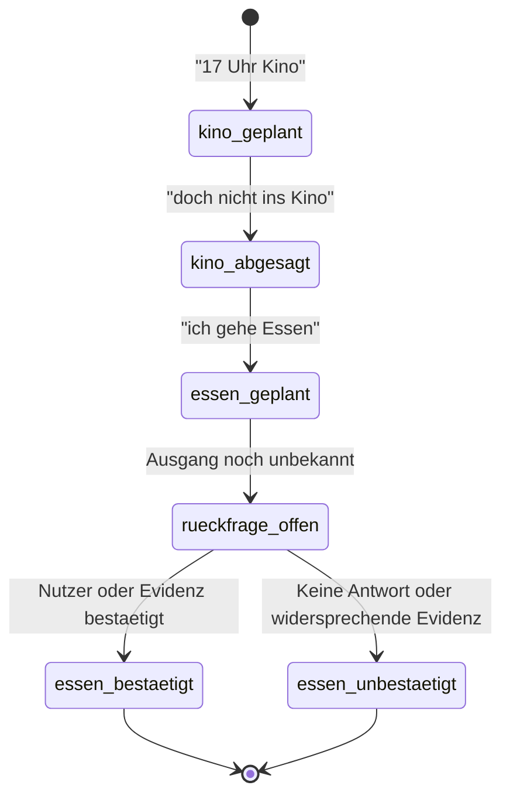

# Zielarchitektur fuer Memory, Knowledge und proaktive Personas

## 📋 Metadaten

| Feld                         | Wert                                                                                            |
| ---------------------------- | ----------------------------------------------------------------------------------------------- |
| Status                       | Architekturentscheidung mit GitHub-Technologierecherche                                         |
| Stand                        | 2026-08-18                                                                                      |
| Repository-Stand der Analyse | `81ed0ac`                                                                                       |
| GitHub-Recherche             | 2026-08-18, offizielle Repositories, Dokumentation und Releases                                 |
| Scope                        | Langzeit-Memory, Knowledge Base, temporale Wahrheit, Tasks, Open Loops und proaktives Verhalten |
| Nicht im Scope               | Fehlersuche, Testanalyse und Implementierung                                                    |

## 🎯 Entscheidung

Die Zielarchitektur fuer eine langfristig mitdenkende persoenliche Sekretaerin lautet:

> PostgreSQL mit pgvector wird das kanonische Weltmodell. Graphiti wird danach als abgeleitete temporale Knowledge-Graph-Projektion eingefuehrt. Mem0 ist nicht mehr die verbindliche Wahrheit und wird nach der Migration entweder auf persoenliche Praeferenzen begrenzt oder entfernt.

| Technologie                        | Entscheidung                                                           |
| ---------------------------------- | ---------------------------------------------------------------------- |
| PostgreSQL als kanonische Wahrheit | Ja                                                                     |
| pgvector fuer semantische Suche    | Ja                                                                     |
| PostgreSQL-Volltextsuche           | Ja                                                                     |
| Graphiti                           | Ja, als abgeleitete Projektion in einer spaeteren Phase                |
| Graphiti als System of Record      | Nein                                                                   |
| OpenClaw-Memory-Muster             | Ja, selektiv fuer Provenienz, Dreaming, Recall und Prospective Memory  |
| Standing Intents                   | Ja, als eigene Domaene fuer ereignisabhaengige Vorhaben                |
| Mem0 als primaeres Memory          | Nein                                                                   |
| Mem0 waehrend der Migration        | Voruebergehend weiterverwenden                                         |
| Bestehender Scheduler              | Zunaechst erweitern; nicht allein wegen einer Alternative ersetzen     |
| pg-boss                            | Kandidat, sobald Queue-Infrastruktur nicht weiter selbst gepflegt wird |
| Hatchet oder Temporal.io           | Spaeter fuer lang laufende, verteilte oder ereigniswartende Workflows  |

Graphiti wird nicht parallel zu PostgreSQL als zweite Wahrheit betrieben. Wenn die Graphiti-Datenbank verloren geht, muss sie vollstaendig aus PostgreSQL und den urspruenglichen Beobachtungen neu aufgebaut werden koennen.

Die GitHub-Recherche hat keine einzelne etablierte Loesung gefunden, die bitemporale Wahrheit, operative Task- und Tool-Zustaende, semantischen Recall, Knowledge Graph und proaktive Workflows gemeinsam als verlaessliches System of Record abdeckt. Die Zielarchitektur bleibt deshalb modular und uebernimmt spezialisierte Komponenten nur innerhalb klarer Verantwortungsgrenzen.

## 🧩 Ausgangssituation

Die aktuelle Architektur kombiniert mehrere Speicher- und Retrieval-Schichten:

1. Raw Messages mit Reihenfolge, Zeitstempeln und FTS5.
2. Mem0 mit PostgreSQL und pgvector fuer semantischen Recall.
3. Eine SQLite-Knowledge-Base fuer Episoden, Meeting-Ledger, Ereignisse, Entitaeten und Beziehungen.
4. Weitere SQLite-Strukturen fuer Tasks, Reminder, Master-Zustaende und Automationen.

Der Recall kombiniert Knowledge, Mem0 und Chat-Historie bereits parallel. Das ist eine gute Retrieval-Grundlage. Es fehlt jedoch ein gemeinsames, transaktionales Weltmodell, das fuer alle Komponenten verbindlich festlegt:

- was nur geplant war,
- was abgesagt wurde,
- was tatsaechlich geschah,
- was lediglich vermutet wird,
- welche Information eine andere ersetzt,
- welche Aufgabe offen oder erledigt ist,
- welche Rueckfrage noch gestellt werden muss.

Die aktuelle Mem0-Integration uebergibt bereits extrahierte Facts mit `infer: false`. Damit liegt die eigentliche Interpretation in Clawtest; Mem0 dient im Wesentlichen als externer semantischer Speicher und Recall-Dienst.[^1]

Knowledge-Ereignisse besitzen Datum, Typ, Bestaetigung und Confidence, aber keinen vollstaendigen Statusautomaten fuer `planned`, `cancelled`, `in_progress`, `completed` oder `no_show`.[^2] Entitaetsbeziehungen werden anhand von Quelle, Ziel und Beziehungstyp aktualisiert, statt eine zeitliche Beziehungshistorie als eigenstaendige Wahrheit zu fuehren.[^3]

Aufgaben aus der Knowledge-Extraktion sind noch nicht identisch mit den kanonischen Mission-Control-Tasks. Erkannte Action Items werden temporaer als `action-N` modelliert und ihre Erledigung als Memory-Fact gespeichert.[^4]

Der vorhandene Proactive-Service bewertet vor allem Themeninteressen und kennt als Entscheidung nur `suggest` oder `defer`. Er ist noch keine Engine fuer offene Sachverhalte, fehlende Termin-Ergebnisse oder zustandsabhaengige Rueckfragen.[^5]

## 🎬 Referenzfall Kino und Essen

### Eingaben

1. `Ich gehe um 17 Uhr ins Kino.`
2. `Ich gehe doch nicht ins Kino. Ich gehe Essen.`

### Erforderlicher kanonischer Zustand

| Vorgang     | Modalitaet           | Status            | Tatsaechlich bestaetigt |
| ----------- | -------------------- | ----------------- | ----------------------- |
| Kinobesuch  | geplant              | abgesagt          | Nein                    |
| Essen gehen | angekuendigt/geplant | Ausgang unbekannt | Noch nicht              |

Die zweite Nachricht beweist zunaechst nur die Planaenderung. Sie beweist nicht automatisch, dass der Nutzer spaeter wirklich essen war. Ohne weitere Evidenz lautet die wahrheitsgetreue Antwort:

> Du wolltest urspruenglich um 17 Uhr ins Kino, hast diesen Plan aber abgesagt und angekuendigt, stattdessen essen zu gehen. Ob du tatsaechlich essen warst, wurde nicht bestaetigt.

Wenn die Persona spaeter fragt `Warst du essen?` und der Nutzer dies bestaetigt, wechselt das Essen-Ereignis zu `completed`. Erst dann darf die spaetere Antwort lauten, dass der Nutzer essen war.

### Zustandsverlauf



## 🧠 Erforderliches Wahrheitsmodell

Das Datenmodell muss zwei Zeitdimensionen unterscheiden:

- **Gueltigkeitszeit:** Wann galt etwas in der realen Welt?
- **Kenntniszeit:** Wann hat das System davon erfahren?

Zusaetzlich muss jede Aussage eine epistemische Modalitaet besitzen:

```text
reported
planned
expected
inferred
observed
confirmed
denied
```

Ein hoher semantischer Aehnlichkeitsscore darf niemals aus `planned` automatisch `completed` machen.

## 🗄️ Kanonische PostgreSQL-Domaenen

### Observations

Unveraenderliche Eingangsdaten aus:

- Chat-Nachrichten,
- E-Mails,
- Kalenderereignissen,
- Standortsignalen,
- Tool-Ausfuehrungen,
- gesendeten Nachrichten,
- Nutzerbestaetigungen.

Wichtige Felder:

```text
id
user_id
persona_id
workspace_id
source_type
source_id
occurred_at
received_at
payload
source_authority
```

### Assertions

Abgeleitete Aussagen ueber die Welt:

```text
subject_id
predicate
object_id oder object_value
polarity
modality
status
confidence
valid_from
valid_to
known_from
known_to
source_observation_id
supersedes_assertion_id
```

### Events und Event Transitions

Empfohlene Ereigniszustaende:

```text
proposed
planned
in_progress
completed
cancelled
no_show
unknown
```

Jeder Zustandswechsel wird angehaengt. Historische Zustaende werden nicht ueberschrieben.

### Tasks und Task Transitions

Tasks muessen dieselben Aufgaben repraesentieren, die auch von der Persona ausgefuehrt und vom Nutzer gesehen werden. Sie benoetigen:

- Auftraggeber,
- verantwortliche Persona oder Person,
- Fälligkeit,
- Abhaengigkeiten,
- Statushistorie,
- Ausfuehrungsversuche,
- Ergebnis,
- Evidenz,
- Freigabestatus.

### Open Loops und Questions

Open Loops speichern ausdruecklich, was die Persona noch nicht weiss oder weiterverfolgen muss.

```text
type:
  clarification
  confirmation
  event_outcome
  dependency
  missing_context
  promised_follow_up

status:
  open
  scheduled
  asked
  answered
  resolved
  cancelled
  expired
```

Weitere Felder:

```text
trigger_at
subject_id
question
missing_information
importance
do_not_ask_before
last_checked_at
deduplication_key
max_attempts
```

### Standing Intents

Standing Intents bilden prospektives Memory fuer ereignisabhaengige Vorhaben. Sie beantworten nicht die Frage, _wann_ etwas ausgefuehrt werden soll, sondern _bei welchem spaeteren Ereignis_ die Persona reagieren soll.

Beispiele:

- `Wenn Mike auf die E-Mail antwortet, erinnere mich an das Angebot.`
- `Wenn Christina das Projekt erwaehnt, frage nach dem Budget.`
- `Wenn der Standort wieder Buero ist, erinnere mich an die Unterlagen.`

Wichtige Felder:

```text
description
trigger_terms
event_type
subject_scope
channel_scope
sender_scope
status
expires_at
cooldown_until
fire_count
max_fires
last_fired_at
deduplication_key
```

Empfohlene Zustaende:

```text
armed
cooldown
done
cancelled
expired
```

Zeitbasierte Erinnerungen bleiben dauerhafte Jobs. Ungeklaerte Sachverhalte bleiben Open Loops. Standing Intents sind ausschliesslich fuer Ereignisse bestimmt, die spaeter in Nachrichten, Kalendern, E-Mails, Tool-Ergebnissen oder anderen Observations auftreten.

### Embeddings

Embeddings werden als abgeleiteter Index gespeichert und enthalten mindestens:

```text
target_type
target_id
model
model_version
embedding
created_at
```

### Transactional Outbox

Jede relevante Zustandsaenderung schreibt in derselben PostgreSQL-Transaktion ein Outbox-Event. Asynchrone Worker aktualisieren daraus:

- Embeddings,
- Graphiti,
- Benachrichtigungen,
- Follow-up-Jobs,
- Analysen.

Dadurch entsteht kein synchroner Dual-Write zwischen PostgreSQL, Graphiti und Mem0.

## 🏗️ Zielarchitektur

```mermaid
flowchart LR
    accTitle: Zielarchitektur der persoenlichen Sekretaerin
    accDescr: PostgreSQL ist die verbindliche Wahrheit. Recall, Graphiti, Standing Intents und proaktive Ausfuehrung sind abgeleitete oder kontrollierte Schichten mit Rueckfluss als neue Evidenz.

    subgraph evidence ["📥 Evidence"]
        sources["Nachrichten, Kalender,<br/>E-Mail, Standort, Tools"]
        observations["📝 Unveraenderliche<br/>Observations"]
        sources --> observations
    end

    subgraph canonical_state ["💾 Kanonische Wahrheit"]
        world_model["PostgreSQL World Model<br/>Events, Assertions, Tasks"]
        open_loops["📋 Open Loops<br/>fehlender Kontext"]
        standing_intents["⚡ Standing Intents<br/>Ereignis-Trigger"]
        outbox["📤 Transactional Outbox"]
        world_model --> open_loops
        world_model --> standing_intents
        world_model --> outbox
    end

    subgraph context ["🔍 Abgeleiteter Kontext"]
        vectors["pgvector und Volltext<br/>hybrides Retrieval"]
        graphiti["🔗 Graphiti<br/>temporale Projektion"]
    end

    subgraph proactive ["⏰ Proaktive Ausfuehrung"]
        scheduler["Dauerhafte Jobs<br/>exakte Zeitpunkte"]
        heartbeat["🔄 Heartbeat<br/>Reconciliation"]
        persona["🤖 Persona<br/>Antworten und Aktionen"]
        channels["📤 Push, Chat, E-Mail"]
        scheduler --> persona
        heartbeat --> persona
        persona --> channels
    end

    observations --> world_model
    world_model --> vectors
    outbox --> graphiti
    open_loops --> scheduler
    standing_intents --> scheduler
    heartbeat --> open_loops
    vectors --> persona
    graphiti --> persona
    channels --> observations

    classDef canonical_style fill:#dcfce7,stroke:#16a34a,stroke-width:2px,color:#14532d
    classDef derived_style fill:#dbeafe,stroke:#2563eb,stroke-width:2px,color:#1e3a5f
    classDef workflow_style fill:#fef9c3,stroke:#ca8a04,stroke-width:2px,color:#713f12

    class observations,world_model canonical_style
    class vectors,graphiti derived_style
    class open_loops,standing_intents,scheduler,heartbeat workflow_style
```



## 🐘 Warum PostgreSQL kanonisch wird

PostgreSQL ist fuer diesen Use Case besser als SQLite, Mem0 oder eine Graphdatenbank als System of Record:

- gemeinsame Transaktionen ueber Events, Tasks, Open Loops und Outbox,
- referenzielle Integritaet,
- kontrollierte Statusuebergaenge,
- Row-Level Security fuer User- und Persona-Isolation,
- JSONB fuer erweiterbare Extraktionsdaten,
- Volltextsuche,
- Range-Typen fuer Zeitintervalle,
- pgvector fuer semantische Suche,
- relationale Abfragen fuer Aufgaben, Kalender und Ausfuehrungsstatus.

PostgreSQL 18 unterstuetzt temporale Schluessel mit `WITHOUT OVERLAPS`. Die Kenntniszeit wird zusaetzlich explizit mit `known_from` und `known_to` modelliert.[^6]

pgvector unterstuetzt exakte Vektorsuche, HNSW, IVFFlat und die Kombination mit PostgreSQL-Volltextsuche. Fuer stark mandantenbezogene ANN-Suche muessen Filterung, Partitionierung und Recall gemeinsam bewertet werden.[^7]

Die kanonische Application-Datenbank bleibt von den internen Mem0-Tabellen getrennt.

## 🕸️ Rolle von Graphiti

Graphiti passt zum Knowledge-Teil des Use Cases, weil es:

- Entitaeten und Beziehungen extrahiert,
- Facts mit zeitlichen Gueltigkeitsfenstern verwaltet,
- ueberholte Facts invalidiert statt zu loeschen,
- Episoden und Provenienz erhaelt,
- historische Abfragen unterstuetzt,
- semantische, lexikalische und graphbasierte Suche kombiniert,
- benutzerdefinierte Ontologien erlaubt.[^8]

Beispielhafte Beziehungen:

```text
User --INTENDS_TO_ATTEND--> CinemaVisit
User --CANCELLED--> CinemaVisit
User --ATTENDED--> Dinner
User --CALLED--> Mike
User --WORKS_ON--> Project
Task --ASSIGNED_TO--> Persona
Meeting --CREATED_ACTION_ITEM--> Task
```

Graphiti darf keine verbindliche Entscheidung darueber treffen, ob eine E-Mail gesendet, eine Aufgabe abgeschlossen, ein Termin besucht oder eine Zahlung ausgefuehrt wurde. Solche Zustaende werden transaktional in PostgreSQL bestaetigt.

Graphiti benoetigt ein separates Graph-Backend. Der aktuelle offizielle Stand nennt unter anderem Neo4j 5.26, FalkorDB und Neptune; Kuzu ist deprecated.[^9]

## 🧠 Zukuenftige Rolle von Mem0

Mem0 wird waehrend der Migration beibehalten, um bestehende Recall-Pfade nicht gleichzeitig mit dem kanonischen Datenmodell ersetzen zu muessen.

Nach der Umstellung gibt es zwei vertretbare Endzustaende:

1. Mem0 speichert nur persoenliche Praeferenzen, Vermeidungen, Stil und Gewohnheiten.
2. Mem0 wird entfernt, weil PostgreSQL/pgvector und Graphiti seine verbleibenden Aufgaben abdecken.

PostgreSQL, Graphiti und Mem0 dauerhaft als gleichwertige Knowledge-Systeme parallel zu betreiben wird nicht empfohlen.

Mem0 OSS v3 verwendet eine ADD-only-Extraktion und hybrides Retrieval. Die fruehere externe Graph-Integration wurde aus OSS entfernt; Graph Memory und Temporal Reasoning liegen auf der Mem0 Platform. Das dortige Temporal Reasoning verbessert vor allem das Ranking zeitlich passender Memories und ersetzt keinen verbindlichen Ereignisstatus. Die veroeffentlichten Plattform-Evaluationen enthalten proprietaere Optimierungen, die nicht vollstaendig im Open-Source-System enthalten sind.[^10]

## 🔄 Proaktive Sekretaerin

### Termin-Follow-up

1. Ein Termin wird als `planned` gespeichert.
2. Ein Open Loop `event_outcome` wird erzeugt.
3. Ein dauerhafter Job wird auf `Terminende + 1 Stunde` gesetzt.
4. Beim Ausloesen prueft der Worker erneut:
   - Wurde der Termin abgesagt?
   - Ist das Ergebnis bereits bekannt?
   - Wurde die Frage schon gestellt?
   - Ist der Nutzer beschaeftigt oder in einer Ruhezeit?
   - Wuerde die Frage das Notification Budget ueberschreiten?
5. Nur bei unbekanntem Ausgang fragt die Persona:

   > Warst du beim Termin mit Mike? Wie ist es verlaufen? Gab es Entscheidungen oder Aufgaben?

6. Die Antwort aktualisiert Termin, Episode, Entscheidungen, Tasks, Abhaengigkeiten und Graph-Projektion.

### Klaerungsfragen

Die Persona fragt sofort nach, wenn eine fehlende Information die Bedeutung oder eine risikoreiche Aktion veraendert:

- `Welche Christina meinst du?`
- `Soll ich die E-Mail nur entwerfen oder auch versenden?`
- `Du hast den Kinoplan geaendert. Soll ich ihn als abgesagt markieren?`

### Heartbeat und dauerhafte Jobs

- **Event Handler:** reagieren sofort auf neue Informationen.
- **Dauerhafte Jobs:** uebernehmen exakte Zeitpunkte und Wartephasen.
- **Standing Intents:** reagieren auf spaetere fachliche Ereignisse.
- **Heartbeat:** findet verpasste Jobs, ueberfaellige Aufgaben und offene Schleifen.

Der Heartbeat ist eine Reconciliation-Schicht und nicht der alleinige Timer.

Der vorhandene Scheduler mit Tick, Retry und Dead Letter kann dafuer zunaechst erweitert werden.[^11] pg-boss ist der bevorzugte Postgres-native Kandidat, sobald atomare Job-Erzeugung, Queue-Management oder weitere Zustellmechanismen nicht mehr selbst gepflegt werden sollen. Hatchet oder Temporal.io werden interessant, wenn Workflows ueber Monate laufen, auf externe Ereignisse oder menschliche Freigaben warten, mehrere Worker-Instanzen koordinieren oder Deployments und Infrastrukturfehler ueberleben muessen. Temporal rekonstruiert Workflow-Zustaende aus einer dauerhaften Event History.[^12]

### Drei Arten prospektiver Memory

| Bedarf                | Domaene         | Beispiel                                                    |
| --------------------- | --------------- | ----------------------------------------------------------- |
| Exakter Zeitpunkt     | Dauerhafter Job | `Frage eine Stunde nach dem Termin nach dem Ergebnis.`      |
| Spaeteres Ereignis    | Standing Intent | `Wenn Mike antwortet, erinnere mich an das Angebot.`        |
| Fehlende Erkenntnis   | Open Loop       | `Ob der Nutzer beim Termin war, ist noch nicht bestaetigt.` |
| Periodische Kontrolle | Heartbeat       | `Pruefe ueberfaellige Open Loops und verpasste Jobs.`       |

Der Heartbeat erzeugt keine Wahrheit aus alten Chat-Inhalten. Er prueft kanonische Zustaende, faellige Jobs und offene Schleifen und bleibt still, wenn keine relevante Aktion ansteht.

## 🔍 GitHub-Technologierecherche

### Bewertungsmassstab

Die Recherche bewertet nicht nur Popularitaet, sondern vor allem:

- explizite Gueltigkeits- und Kenntniszeit,
- Historie statt destruktiver Ueberschreibung,
- Provenienz und Unsicherheit,
- Tasks, Aktionen und reale Tool-Ergebnisse,
- ereignis- und zeitbasierte Proaktivitaet,
- Self-Hosting und Lizenz,
- Integrationsrisiko fuer den bestehenden TypeScript-Stack.

### Untersuchte Kernkandidaten

| Kandidat    | Nachgewiesene Staerke                                         | Entscheidende Grenze                                   | Verwendung in Clawtest                |
| ----------- | ------------------------------------------------------------- | ------------------------------------------------------ | ------------------------------------- |
| OpenClaw    | Memory-Tiers, Provenienz, Dreaming, Standing Intents          | Dateien und SQLite sind kein ausreichendes Weltmodell  | Verhaltensmuster selektiv uebernehmen |
| Letta Code  | Agentenidentitaet, Git-Memory, Dreaming, selbst geplante Jobs | Kein typisiertes Ereignis- und Action-Ledger           | Inspirationsquelle                    |
| Graphiti    | Temporale Beziehungen, Invalidierung und Episoden             | Kein operatives System of Record                       | Empfohlene Graph-Projektion           |
| Cognee      | Knowledge Graph, Ontologien, Vektor- und Graphsuche           | Temporale Konfliktaufloesung ist neu und opt-in        | Beobachten, nicht statt Graphiti      |
| Supermemory | Memory Graph, Updates, Profile und lokales Self-Hosting       | Kein verbindlicher Task- oder Ereignisstatus           | Moegliche Mem0-Alternative            |
| Mem0 OSS v3 | Einfache Extraktion und hybrider Recall                       | Graph und Temporal Reasoning nicht in OSS              | Migration, spaeter begrenzen          |
| LangMem     | Hot-Path- und Background-Memory-Manager                       | Kein Weltmodell und keine fachliche temporale Wahrheit | Kein Framework-Wechsel                |
| XTDB        | Native Bitemporalitaet und unveraenderliche Historie          | Zusaetzlicher JVM-, Storage- und Integrationsaufwand   | Spaeterer Spezialkandidat             |
| pg-boss     | Postgres-native Jobs, Retry, Cron und transaktionales Enqueue | Kein Knowledge- oder Agentensystem                     | Optionaler Scheduler-Unterbau         |
| Hatchet     | Durable Workflows, Event-Waits, Sleep und TypeScript          | Zusaetzlicher Dienst und Betriebsaufwand               | Spaetere Workflow-Option              |

OpenClaw ist der staerkste Uebernahmekandidat fuer die Verhaltensarchitektur. Seine aktuelle Memory-Architektur trennt kuratiertes, episodisches und prospektives Memory, versieht Eintraege mit Provenienz und verwendet Dreaming fuer kontrollierte Konsolidierung.[^13] Standing Intents speichern ereignisabhaengige Vorhaben mit Lifecycle, Cooldown und Fire Budget, waehrend zeitbasierte Vorhaben als Jobs behandelt werden.[^14] OpenClaw trennt ausserdem exakte Automationen vom kontextsensitiven Heartbeat.[^15]

Letta Code bestaetigt den Wert von langfristiger Agentenidentitaet, Git-versioniertem Memory, Hintergrund-Dreaming und selbst erzeugten Zeitplaenen. Diese Mechanismen eignen sich fuer Persona-Identitaet und Reflexion, ersetzen aber kein fachlich typisiertes Weltmodell.[^16]

Cognee besitzt inzwischen Provenienz- und Temporalitaetsfunktionen. Die Konfliktaufloesung fuer funktionale Beziehungen ist jedoch opt-in, laeuft nach der Graphspeicherung und darf bei Fehlern die Ingestion nicht blockieren.[^17] Die zeitlichen und auditierbaren Funktionen wurden erst kurz vor der Recherche stark ausgebaut, waehrend Release `v1.5.0` vor allem Graphmigration und Adapterstabilitaet adressiert.[^18] Graphiti bleibt deshalb die reifere Wahl fuer die temporale Projektion.

Supermemory bietet ein lebendes Memory Graph mit `updates`, `extends`, `derives`, automatischem Vergessen und lokalem Self-Hosting. Diese Funktionen sind stark fuer Recall und Nutzerprofile, modellieren aber keine verbindlichen fachlichen Statusuebergaenge fuer Termine, Tasks oder gesendete E-Mails.[^19]

LangMem bietet Werkzeuge fuer Memory-Schreiben im aktiven Agentenpfad und einen Background Memory Manager. Fuer Produktion verweist das Projekt auf einen persistenten Store wie `AsyncPostgresStore`; die fachliche Struktur und Konfliktlogik muss die Anwendung dennoch selbst definieren.[^20]

XTDB ist der ernsthafteste Datenbank-Challenger, weil es Gueltigkeitszeit und Systemzeit nativ fuer alle Daten versioniert und historische SQL-Abfragen erleichtert. Die zusaetzliche JVM-, Log- und Object-Storage-Architektur sowie die geringere Passung zu vorhandenen Postgres-Werkzeugen rechtfertigen aktuell keinen Wechsel des kanonischen Speichers.[^21]

pg-boss nutzt PostgreSQL fuer Hintergrundjobs, `SKIP LOCKED`, Cron, Retry und transaktionale Job-Erzeugung. Es ist eine passende Evolutionsoption, wenn Clawtest die Queue-Mechanik nicht dauerhaft selbst warten soll.[^22] Hatchet ist eine spaetere Alternative fuer dauerhafte Sleeps und das Warten auf externe Ereignisse; es nutzt PostgreSQL als Durability Layer und bietet TypeScript-Unterstuetzung.[^23]

### Ergebnis der Recherche

Es gibt keine einzelne etablierte Loesung, die den Clawtest-Use-Case vollstaendig besser abdeckt. Der beste Ansatz ist eine kontrollierte Kombination:

1. PostgreSQL fuer verbindliche Wahrheit und operative Zustaende.
2. OpenClaw-Muster fuer Memory-Tiers, Provenienz, Dreaming und Prospective Memory.
3. pgvector und Volltext fuer hybriden Recall.
4. Graphiti fuer eine neu aufbaubare temporale Graph-Projektion.
5. Bestehender Scheduler oder spaeter pg-boss fuer einfache dauerhafte Jobs.
6. Hatchet oder Temporal erst fuer nachgewiesene komplexe Workflow-Anforderungen.

## 📊 Technologievergleich

| Ansatz                        | Zeitliche Wahrheit | Aufgaben und Aktionen | Beziehungen | Semantischer Recall | Bewertung                                     |
| ----------------------------- | ------------------ | --------------------- | ----------- | ------------------- | --------------------------------------------- |
| Aktuelles SQLite + Mem0       | Mittel             | Mittel                | Mittel      | Gut                 | Gute Grundlage, nicht Best Case               |
| Nur Mem0 oder Supermemory     | Mittel             | Schwach               | Mittel      | Sehr gut            | Kein kanonisches Weltmodell                   |
| OpenClaw oder Letta allein    | Mittel             | Mittel                | Mittel      | Gut                 | Starker Agent, aber keine belastbare Wahrheit |
| Nur Graphiti oder Cognee      | Gut                | Schwach               | Sehr gut    | Sehr gut            | Kein operatives System of Record              |
| XTDB als kanonischer Speicher | Sehr gut           | Gut                   | Gut         | Mittel              | Temporal stark, Integrationsaufwand hoch      |
| PostgreSQL + pgvector         | Sehr gut           | Sehr gut              | Gut         | Sehr gut            | Starker pragmatischer Kern                    |
| PostgreSQL + Graphiti         | Sehr gut           | Sehr gut              | Sehr gut    | Sehr gut            | Empfohlener Best Case                         |
| Zep managed                   | Gut                | Schwach               | Sehr gut    | Sehr gut            | Managed-Alternative mit Vendor-Abhaengigkeit  |

Die Tabelle ist eine Architekturbeurteilung und kein unabhaengiger Produktbenchmark.

## 🚚 Implementierungsreihenfolge

### Phase 1: PostgreSQL als System of Record

- Observations
- Assertions
- Events und Event Transitions
- Tasks und Task Transitions
- Entities und Relations
- Open Loops und Questions
- Standing Intents
- Action Attempts
- Outbox
- Embeddings

### Phase 2: Schreibpfade vereinheitlichen

Nachrichten, Kalenderaenderungen, Tool-Ergebnisse und Nutzerkorrekturen schreiben zuerst nach PostgreSQL. Mem0 und die bestehende SQLite-Knowledge bleiben voruebergehend kompatible Projektionen.

### Phase 3: Retrieval umstellen

Die Retrieval-Reihenfolge lautet:

1. strukturierte Zustandsabfragen,
2. Volltextsuche,
3. pgvector,
4. Raw Evidence,
5. spaeter Graphiti.

Strukturierte Wahrheit hat Vorrang vor semantischer Aehnlichkeit.

### Phase 4: Prospective-Memory-Engine

- Klaerungsfragen
- Termin-Follow-ups
- Aufgabenabhaengigkeiten
- versprochene Rueckmeldungen
- ueberfaellige Bestaetigungen
- ereignisabhaengige Standing Intents
- exakte One-shot Jobs
- Heartbeat-Reconciliation
- Ruhezeiten und Benachrichtigungsregeln

Der vorhandene Scheduler wird zuerst weiterverwendet. pg-boss wird nur dann eingefuehrt, wenn transaktionales Enqueue und Queue-Betrieb andernfalls als eigene Infrastruktur weiterentwickelt werden muessten.

### Phase 5: Graphiti im Shadow Mode

Graphiti wird ausschliesslich ueber die PostgreSQL-Outbox befuellt. Seine Ergebnisse werden zunaechst gemessen, ohne Antworten oder Aktionen verbindlich davon abhaengig zu machen.

### Phase 6: Mem0 reduzieren

Nach erfolgreicher pgvector- und Graphiti-Einfuehrung wird Mem0 auf Praeferenzen begrenzt oder entfernt.

### Phase 7: Durable Workflows bei Bedarf

Hatchet oder Temporal werden erst eingefuehrt, wenn mindestens eines dieser Kriterien erreicht ist:

- Workflows warten ueber Deployments hinweg auf externe Ereignisse.
- Freigaben oder Nutzerantworten koennen Tage oder Monate dauern.
- Mehrere Worker-Instanzen muessen denselben Workflow sicher koordinieren.
- Replay, Workflow-Versionierung und detaillierte Laufhistorie werden fachlich erforderlich.

## ✅ Zielverhalten

Die Architektur ist fuer den Use Case geeignet, wenn die Persona langfristig und nachvollziehbar:

- Plaene von tatsaechlichen Ereignissen unterscheidet,
- Aenderungen und Absagen historisch erhaelt,
- Aussagen auf ihre Quellen zurueckfuehrt,
- Unsicherheit offen ausweist,
- Personen, Projekte und Beziehungen ueber lange Zeit verbindet,
- Aufgaben bis zu einem belegten Ergebnis verfolgt,
- selbststaendig relevante Rueckfragen plant,
- alte Follow-ups bei Planaenderungen storniert,
- E-Mail-, Kalender- und Tool-Aktionen mit ihrem realen Ergebnis verknuepft.

## 📌 Endgueltige Empfehlung

1. PostgreSQL jetzt kanonisch machen.
2. pgvector und PostgreSQL-Volltextsuche fuer kontrolliertes hybrides Retrieval verwenden.
3. Graphiti danach als temporale Knowledge-Graph-Projektion einfuehren.
4. Mem0 aus der Rolle des zentralen Memory-Systems entfernen.
5. Open Loops und dauerhafte Follow-up-Jobs als eigene Domaenenobjekte modellieren.
6. Standing Intents fuer ereignisabhaengige Vorhaben einfuehren.
7. OpenClaws Provenienz-, Dreaming- und Recall-Eskalationsmuster selektiv uebernehmen.
8. Den Heartbeat als Kontrollschicht verwenden, nicht als alleinigen Scheduler.
9. Den bestehenden Scheduler zunaechst behalten und pg-boss nur bei echtem Queue-Bedarf einsetzen.
10. Hatchet oder Temporal erst bei lang laufenden oder verteilten Workflow-Anforderungen einfuehren.

PostgreSQL allein waere bereits eine robuste Loesung. PostgreSQL plus Graphiti ist die passendere Best-Case-Zielarchitektur, wenn die Persona ueber Jahre hinweg Personen, Projekte, Beziehungen, Plaene, Aenderungen und tatsaechliche Ereignisse logisch miteinander verbinden soll.

## 📚 Quellen und Codebelege

[^1]: Lokaler Code: [`src/server/memory/mem0/operations/store.ts`](../src/server/memory/mem0/operations/store.ts#L37).

[^2]: Lokaler Code: [`src/server/knowledge/eventTypes.ts`](../src/server/knowledge/eventTypes.ts#L23).

[^3]: Lokaler Code: [`src/server/knowledge/repositories/migrations.ts`](../src/server/knowledge/repositories/migrations.ts#L170).

[^4]: Lokaler Code: [`src/server/knowledge/ingestion/taskCompletion.ts`](../src/server/knowledge/ingestion/taskCompletion.ts#L36).

[^5]: Lokaler Code: [`src/server/proactive/types.ts`](../src/server/proactive/types.ts#L3) und [`src/server/proactive/service.ts`](../src/server/proactive/service.ts#L302).

[^6]: PostgreSQL Global Development Group. "PostgreSQL 18: CREATE TABLE." https://www.postgresql.org/docs/18/sql-createtable.html

[^7]: pgvector. "Open-source vector similarity search for Postgres." https://github.com/pgvector/pgvector

[^8]: Graphiti. "Build Temporal Context Graphs for AI Agents." https://github.com/getzep/graphiti

[^9]: Graphiti. "Installation Requirements." https://github.com/getzep/graphiti#installation

[^10]: Mem0. "Open Source: Migrating to the New Memory Algorithm" und "Temporal Reasoning." https://github.com/mem0ai/mem0/blob/main/docs/migration/oss-v2-to-v3.mdx und https://github.com/mem0ai/mem0/blob/main/docs/platform/features/temporal-reasoning.mdx

[^11]: Lokaler Code: [`src/server/automation/runtime.ts`](../src/server/automation/runtime.ts#L31) und [`src/server/automation/service.ts`](../src/server/automation/service.ts#L205).

[^12]: Temporal Technologies. "Temporal Workflow." https://docs.temporal.io/workflows

[^13]: OpenClaw. "Memory Architecture." https://github.com/openclaw/openclaw/blob/main/docs/concepts/memory-architecture.md

[^14]: OpenClaw. "Standing Intents." https://github.com/openclaw/openclaw/blob/main/docs/concepts/standing-intents.md

[^15]: OpenClaw. "Automation" und "Heartbeat." https://github.com/openclaw/openclaw/blob/main/docs/automation/index.md und https://github.com/openclaw/openclaw/blob/main/docs/gateway/heartbeat.md

[^16]: Letta. "Letta Code." https://github.com/letta-ai/letta-code

[^17]: Cognee. "Temporal Contradiction Resolution." https://github.com/topoteretes/cognee/blob/main/cognee/tasks/graph/resolve_temporal_contradictions.py

[^18]: Cognee. "Release v1.5.0." https://github.com/topoteretes/cognee/releases/tag/v1.5.0

[^19]: Supermemory. "Graph Memory" und "Self-hosting Overview." https://github.com/supermemoryai/supermemory/blob/main/apps/docs/concepts/graph-memory.mdx und https://github.com/supermemoryai/supermemory/blob/main/apps/docs/self-hosting/overview.mdx

[^20]: LangChain. "LangMem." https://github.com/langchain-ai/langmem

[^21]: JUXT. "XTDB." https://github.com/xtdb/xtdb

[^22]: pg-boss. "Queueing jobs in Postgres from Node.js like a boss." https://github.com/timgit/pg-boss

[^23]: Hatchet. "An orchestration engine for background tasks, AI agents, and durable workflows." https://github.com/hatchet-dev/hatchet
