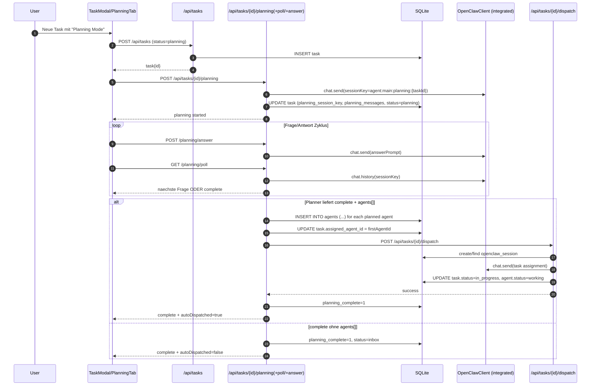
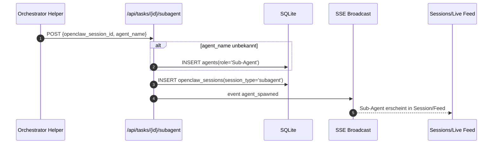

# Mission Control: Task -> Planning -> Agent Spawn -> Dispatch

## Sequenzdiagramm (Planning -> Auto-Spawn -> Dispatch)

## Optional: separater Sub-Agent-Spawn-Pfad

## Code-Anker

- Planning-Start/Session-Key: `app/api/tasks/[id]/planning/route.ts:132`
- Planner fordert `agents[]` bei Completion: `app/api/tasks/[id]/planning/answer/route.ts:56`
- Auto-Spawn (`INSERT INTO agents`): `app/api/tasks/[id]/planning/poll/route.ts:76`
- Auto-Assign + Auto-Dispatch: `app/api/tasks/[id]/planning/poll/route.ts:158`
- Dispatch-Logik (Session + `chat.send` + Statusupdate): `app/api/tasks/[id]/dispatch/route.ts:91`
- Sub-Agent Registrierung: `app/api/tasks/[id]/subagent/route.ts:14`
